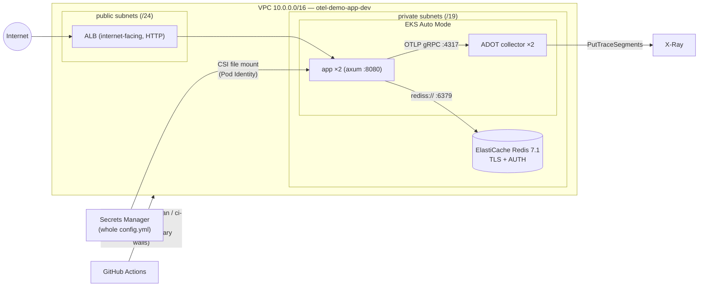

# opentelemetry-demo-app

A basic Rust application which generates traces using OpenTelemetry — and,
since the SRE onsite assignment, the **infrastructure monorepo that runs it**:
a secure AWS environment (EKS + observability) built entirely with Terraform,
the app served publicly, every Kubernetes resource declarative, all applies
owned by CI. Amendments to the original prompt: the app depends on
**ElastiCache Redis**, and only **dev** is stood up by default — staging,
prod, and any further environment are one opt-in away
([runbook](docs/bootstrap.md#6--adding-an-environment)) and deploy by
promotion, never by rebuild.

Fork of the Latent-ML demo app; upstream's app docs are preserved under
[Local development](#local-development).

## Architecture



Every pod's AWS access is EKS Pod Identity (no IRSA, no static keys); the
app's only permission is reading its own config secret, the collector's is
write-only X-Ray. Logs ship via the CloudWatch observability add-on;
ALB alarms + dashboard live in `terraform/modules/stack/alerting.tf`.

## How it was built — the PR series

| PR | What landed |
|---|---|
| #1 | CI gates: fmt/clippy/test/audit, terraform fmt, hadolint, shellcheck, Trivy, Dockerfile |
| #2 | `terraform/bootstrap/` — GitHub OIDC provider, the three CI roles, permission boundaries, budgets + `docs/bootstrap.md` |
| #3 | `terraform/shared/` — account-shared ECR (immutable tags), gated CI plan/apply |
| #4 | App cluster-readiness: `rediss://` TLS support, `/healthz`, OTel flush on shutdown |
| #5 | `terraform/modules/stack` + env roots — VPC, EKS Auto Mode, logging, alerting, collector identity |
| #6 | ElastiCache Redis (TLS+AUTH), config-secret, app Pod Identity |
| #7 | `charts/app`, `deploy/` roster + env values, ADOT collector manifest, helm CI gates |
| #8 | CD: deploy + release jobs, `scripts/smoke.sh` deploy gate, `destroy.yml` |
| #9 | These docs |
| #10–#12 | Production hardening from the first live incident: smoke-gate exec bit; real Redis error surfacing (bb8's default `NopErrorSink` had been masking every connection failure); the security-group hypothesis disproved by live test and reverted; rustls `tls12` feature restored — redis-rs had compiled TLS 1.2 out while ElastiCache negotiates only TLS 1.2 |
| #13–#15 | Docs truth-sync; the [demo cheat sheet](docs/demo-cheatsheet.md); `promote.yml` — build-once/promote-many to any number of gated environments |

## Bring-up from zero

1. One local apply, ever: follow [docs/bootstrap.md](docs/bootstrap.md) —
   state bucket, `terraform/bootstrap` apply, repo variables, GitHub
   environment `dev`.
2. Merge to `main` (or `workflow_dispatch` the `ci` workflow). CI applies
   shared ECR then the dev stack (first apply ~15–20 min), builds and pushes
   the image, `helm upgrade --install`s the roster, and gates on
   `scripts/smoke.sh cloud` — healthz + greeting through the ALB, plus
   **visitor-counter monotonicity**, which proves the ElastiCache TLS+AUTH
   round trip end to end. The run summary prints the serving URL.
   Releases are driven by PR titles via the merge commit (merge-commit or
   squash); rebase-merge would bypass bump detection — disable it in repo
   settings.

## Promotion — staging, prod, and beyond

Dev is continuous: merge to `main` and it deploys. Every other environment
is a **promotion**, never a rebuild — Actions → **promote** → name the
environment and a version (empty = this ref's HEAD, or a `vX.Y.Z` tag, or a
full SHA). The `resolve` job posts the service→digest manifest to the run
summary *before* the approval prompt, so the reviewer approves a specific
artifact; the approved jobs then apply that env's Terraform (cold bring-up
and warm no-op are the same button) and deploy the image dev already smoked.

The environment is a plain string validated against `terraform/envs/<env>/`,
so a fourth environment is a bootstrap tfvars entry, a GitHub Environment,
an env root and a values file — **no workflow edit**. Full runbook:
[docs/bootstrap.md § Adding an environment](docs/bootstrap.md#6--adding-an-environment).
Each running environment is a parallel stack (VPC + NAT + EKS + ALB +
ElastiCache), not a namespace — assume promote → drill → destroy unless you
mean to pay for uptime.

## Teardown

Actions → **destroy** → type `destroy`, name the environment. The workflow
uninstalls the Helm releases and waits for the Auto-Mode-owned ALB to be
reaped *before* `terraform destroy` (the ALB isn't in Terraform state — the
classic VPC-hang). Bootstrap identity and shared ECR deliberately survive.

## Local development

```bash
docker compose up -d          # Redis + Jaeger (UI on :16686)
cargo run -- -f config.yml    # serves http://127.0.0.1:8080
```

Or build the release binary with `cargo build --release` and run
`target/release/opentelemetry-demo-app -f config.yml`. The container image is
`docker build --platform linux/amd64 .` (musl static on chainguard/static).
`OTEL_EXPORTER_OTLP_ENDPOINT` configures the OTLP gRPC trace destination.

## Repo map

| Path | What |
|---|---|
| `src/`, `Cargo.toml`, `Dockerfile` | the Rust app and its image |
| `terraform/bootstrap/` | CI identity: OIDC, roles, boundaries (the one local apply) |
| `terraform/shared/` | account-shared ECR |
| `terraform/modules/stack/` + `terraform/envs/{dev,staging,prod}/` | the per-env stack and its thin roots |
| `charts/app/` | the one generic chart every service releases from |
| `deploy/services/` | the roster — one values file per service |
| `deploy/envs/` | environment-qualified values (last `-f` wins) |
| `deploy/cluster/` | cluster-scoped YAML (ADOT collector) |
| `scripts/` | `roster.sh` (the roster's one parser), `smoke.sh` (the deploy gate) |
| `.github/workflows/` | `ci.yml` (gates → infra → deploy → release), `destroy.yml` |
| `docs/` | [bootstrap](docs/bootstrap.md) · [decisions](docs/DECISIONS.md) · [deferred work](docs/DEFERRED.md) · [demo cheat sheet](docs/demo-cheatsheet.md) |
